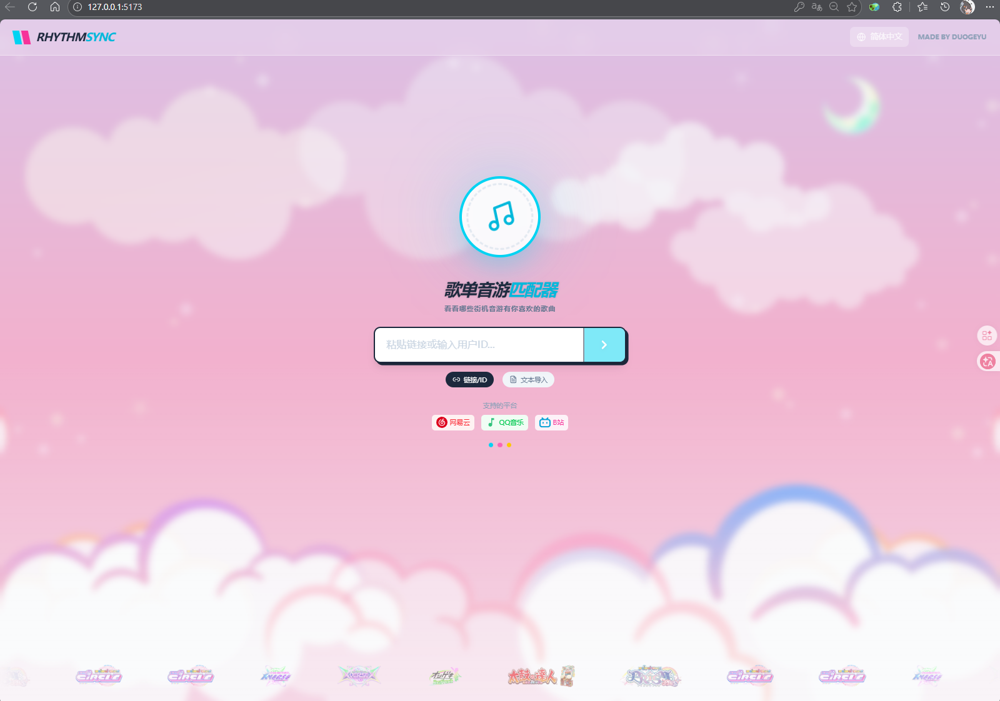
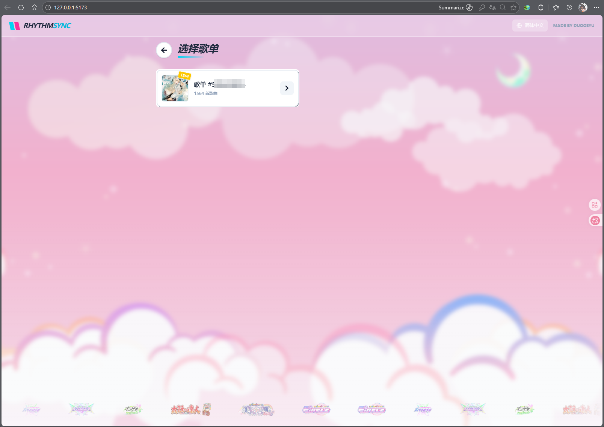
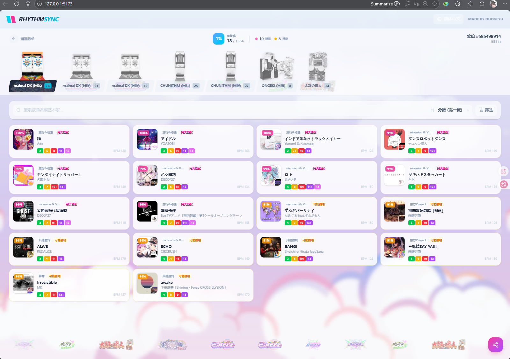
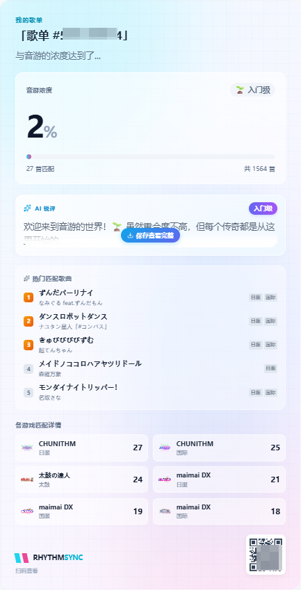

# 🎵 Rhythm_Sync — Playlist × Arcade Rhythm Game Matcher

中文 (**[中文文档](./README.md)**) | English

> How many songs in your playlist are playable in arcade rhythm games?

**Rhythm_Sync** matches your music playlists against arcade rhythm game song databases. Paste a link from NetEase Cloud Music, QQ Music, or Bilibili, and instantly discover which of your favorite songs appear in maimai, CHUNITHM, ONGEKI, Taiko no Tatsujin, and more.

## ✨ Features

- 🎮 **Multi-game support** — maimai DX (Intl/JP/CN), CHUNITHM (Intl/JP), ONGEKI, Taiko no Tatsujin
- 🔗 **Multi-platform input** — NetEase Cloud Music, QQ Music, Bilibili favorites, or plain text song lists
- 🔍 **Smart matching** — Exact + fuzzy matching (Fuse.js) with automatic handling of title variants and translations
- 📊 **Rhythm concentration** — See what percentage of your playlist overlaps with arcade game libraries
- 🤖 **AI commentary** — Generate fun AI-powered comments about your results (optional, requires API key)
- 🖼️ **Shareable cards** — Generate beautiful share images with QR codes
- 🌐 **Bilingual UI** — Full Chinese / English interface
- ⚡ **Streaming results** — Worker threads + Server-Sent Events for real-time matching progress

## 🎮 Supported Games

| Game | Versions |
|------|----------|
| maimai DX | International / JP / CN |
| CHUNITHM | International / JP |
| ONGEKI | JP |
| Taiko no Tatsujin | — |

## 📖 Usage

1. Open the web app and paste your **NetEase / QQ Music / Bilibili** link (or enter songs manually)
2. Select a playlist
3. Wait for matching to complete and browse your results across all supported games
4. Optional: Generate a share image to show off your rhythm game concentration 🎯

## 🛠️ Tech Stack

| Layer | Technologies |
|-------|-------------|
| Frontend | React 19, TypeScript 5.9, Vite 7, Tailwind CSS 4, Framer Motion, i18next |
| Backend | Node.js, Express 5, Worker Threads, Fuse.js / fuzzysort |
| Image Generation | Puppeteer, Sharp, QRCode |
| Music Platforms | NeteaseCloudMusicApi, QQ Music / Bilibili API |

## 🚀 Getting Started

### Prerequisites

- Node.js >= 18
- npm

### Installation

```bash
# Clone the repo
git clone https://github.com/your-username/Rhythm_Sync.git
cd Rhythm_Sync

# --- Backend ---
cd server
npm install
cp .env.example .env   # Edit .env as needed
npm run dev             # Runs on http://localhost:3002

# --- Frontend (new terminal) ---
cd ../frontend
npm install
npm run dev             # Runs on http://localhost:5173
```

### Environment Variables

Copy `server/.env.example` to `server/.env`:

| Variable | Description | Default |
|----------|-------------|---------|
| `APP_ACCESS_PASSWORD` | Access password; leave empty to disable auth | — |
| `SILICONFLOW_API_KEY` | API key for AI commentary; leave empty for local fallback | — |
| `SILICONFLOW_API_URL` | AI API endpoint | `https://api.siliconflow.cn/v1/chat/completions` |
| `SILICONFLOW_MODEL` | AI model name | `Pro/deepseek-ai/DeepSeek-V3` |
| `PUBLIC_WEB_URL` | Public site URL used as QR target in shared images | Auto-derived (e.g. `http://current-host:5173`) |

## 📁 Project Structure

```
Rhythm_Sync/
├── frontend/               # React frontend
│   ├── src/
│   │   ├── components/     # UI components
│   │   ├── config/         # Game configuration
│   │   ├── i18n/           # Internationalization
│   │   ├── services/       # API client
│   │   └── utils/          # Utilities
│   └── public/             # Static assets (logos, backgrounds, etc.)
├── server/                 # Node.js backend
│   ├── index.js            # Express main server
│   ├── match_worker.js     # Matching worker thread
│   ├── utils.js            # Title normalization
│   ├── config/             # Data source configuration
│   └── public/             # Admin page
└── API_DOCS.md             # API documentation
```

## 📸 Screenshots

> Put screenshots in `docs/screenshots/` with the following filenames.

### Home


### Playlist Selection


### Match Results


### Share Card


## 🤝 Contributing

Issues and Pull Requests are welcome!

## 📄 License

This project is licensed under the [GPL-3.0 License](./LICENSE).

## 🙏 Acknowledgments

- Song databases: [Diving-Fish](https://www.diving-fish.com/), [OTOGE-DB](https://otoge-db.com/), [Reiwa](https://reiwa.f5.si/), [Taiko Wiki](https://taiko.wiki/), and others
- Game logos and assets are property of their respective copyright holders — see CREDITS.md under `frontend/public/`
